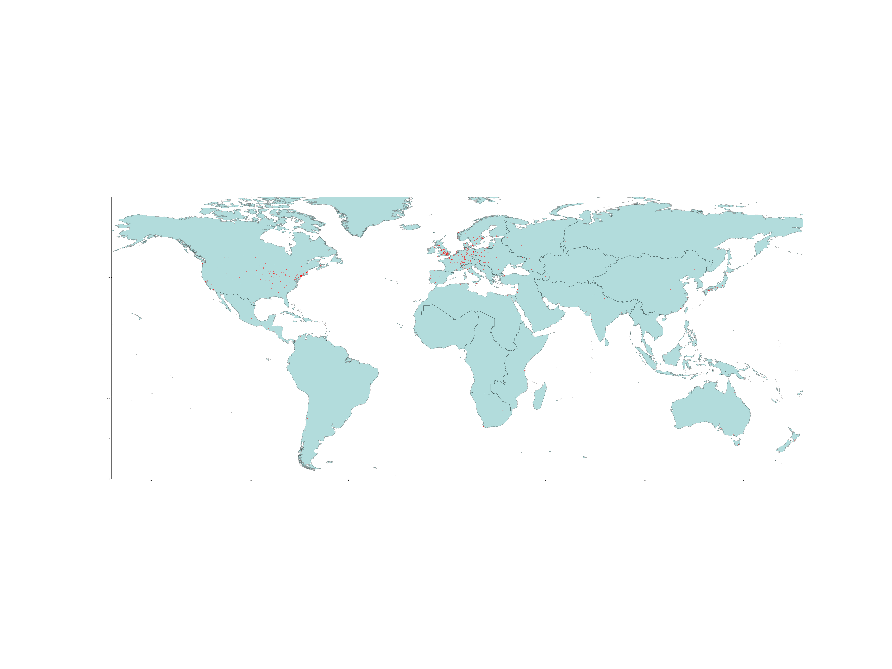
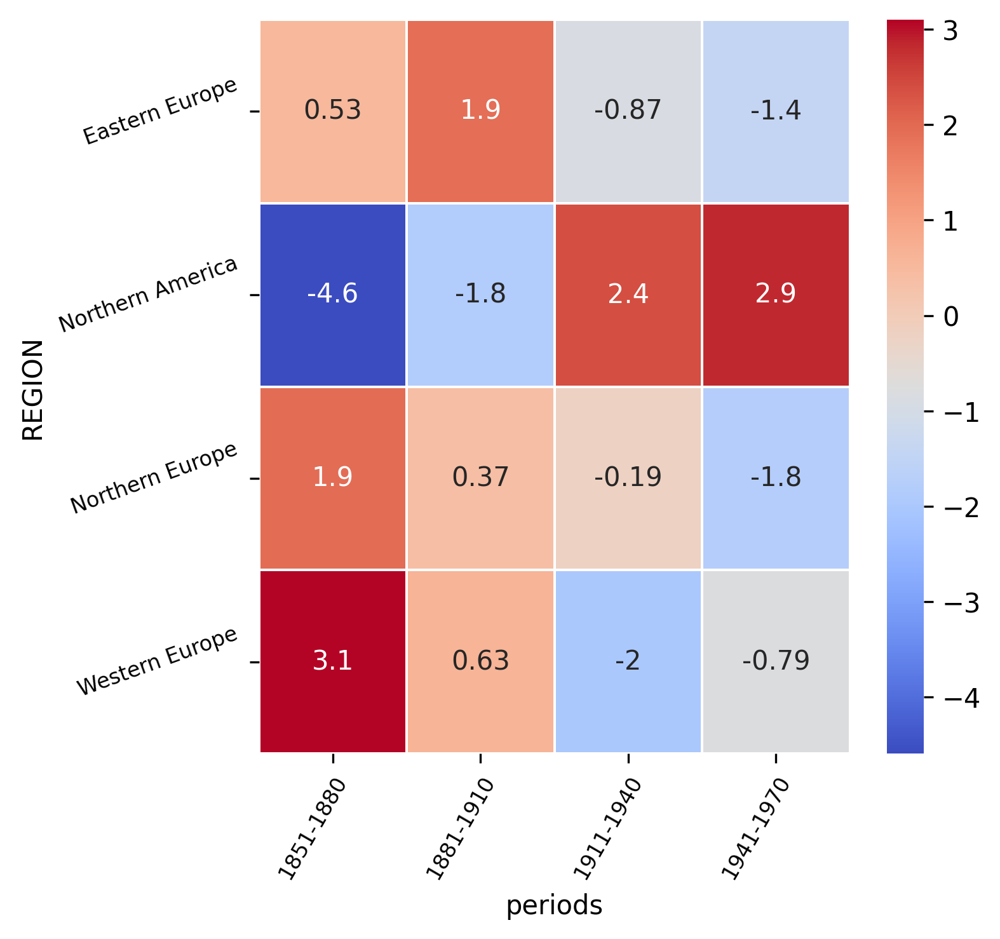

# Distribution in time and space of births of the population

## Population by place of birth

There is a preponderance of births in Europe and in the United States.

## Time distribution

Thanks to a bivariate analysis of the regions of origin in relation to 'generations' (periods of 30 years) we observe the evolution over time

