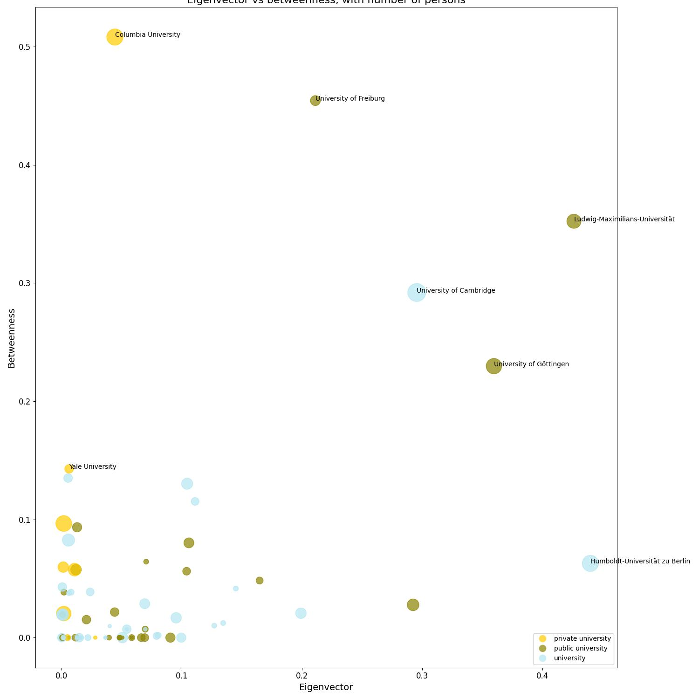

# Networks of organisations

**Research Question**: Do specific universities or other institutions increase the likelihood of winning a Nobel Prize? Have these institutions produced multiple Nobel laureate over time?

## Eigenvector vs betweenness, with number of persons

* Columbia University and the University of Freiburg both score near the top of betweenness with a lower eigenvector and bubble-size. That tells us that many laureates have passed through them in career transitions, collaborations, or joint appointments.
* University of Cambridge, Ludwig-Maximilians-Universität München, and Humboldt-Universität zu Berlin rank at the far right. They have many laureates (large bubbles) and are also linked to other major institutions which shows that they influential and in the center of the global network. 

## Results

Being connected to a top elite, research universities greatly boosts the liklihood of winning a Nobel Prize. Institutions like the University of Cambridge, Harvard, LMU Munich and Humboldt-Berlin are situated at the very center of the laureate network (high eigenvector) and they’ve produced many Nobel winners over decades.
