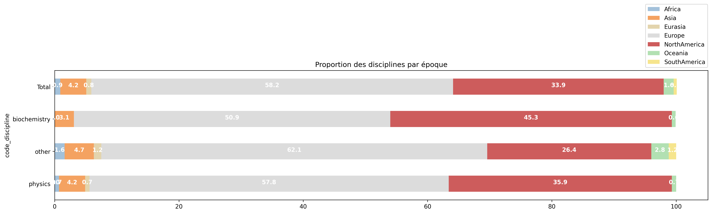
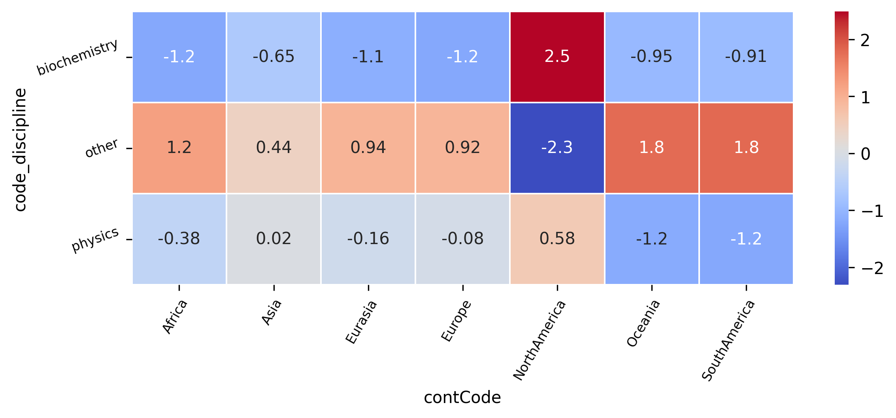

# Distribution of the disciplines in relation to the geographical origin of the Nobel laureates 
Question: Is there a correlation between a laureate's socio-demographic (geographical origin) factors and their discipline?

## Distribution of the disciplines across continents

Among all possible disciplines, physics and biochemistry appeared as the most dominant and were selected for this analysis. The distribution of these disciplines across continents reveals that Europe has the highest representation, followed by North America. The remaining regions account for a significantly smaller proportion.

* Biochemistry: North America stands out,  far more biochemists than average come from the U.S./Canada. Every other continent is below the global baseline, indicating under-representation.
* Other disciplines (all prizes outside biochemistry & physics): North America is strongly under-represented, while every other continent shows a far lower proportion of “other” disciplines. Africa, Oceania and South America punch above their weight compared to the baseline.
* All values hover near zero, there is a  much more even, global distribution of physics Nobel winners.

## Results
* Biochemistry is is hugely concentrated in North America.
* Physics is the most evenly distributed discipline.
* Other disciplines favor Europe, Oceania, South & Africa over North America. 

