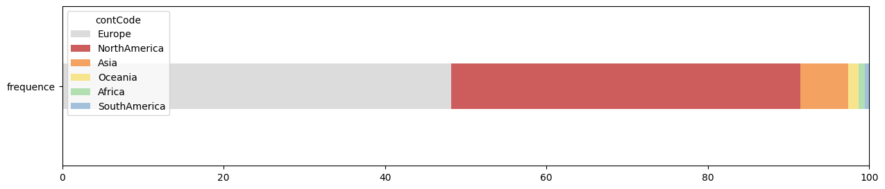
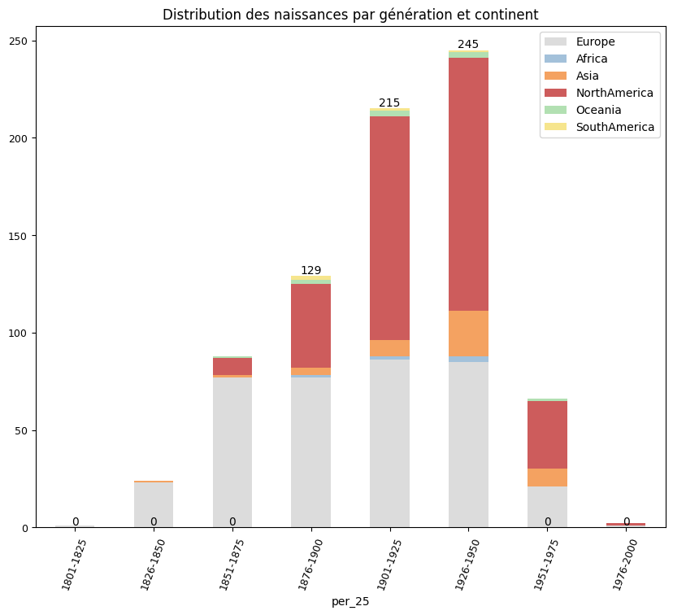
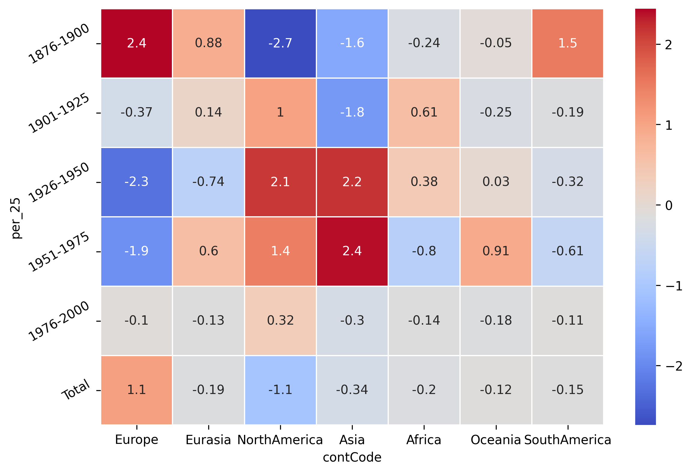

# Results from the analysis in connection with the asked question

## Distribution of the continents

A closer look at this distribution of Nobel laureates reveals a geographical imbalance. Nearly half (48%) are based in Europe, while 43% are located in North America. This means that a astounding 91% of all Nobel Prize winners come from just these two regions, leaving only 9% to represent the rest of the world combined.
 
## Distribution of the generations and continents in time

By looking at the distribution that combines both the continents and different periods it is very noticable that in the 50 years period from 1901-1950 there is significant increase in the number of nobel laureates in Europe and North America and slight increase in the numebr of nobel laureates in Asia

From a historical viewpoint the Nobel Prize started in Europe, and for a long time, only Western achievements were recognized. 

